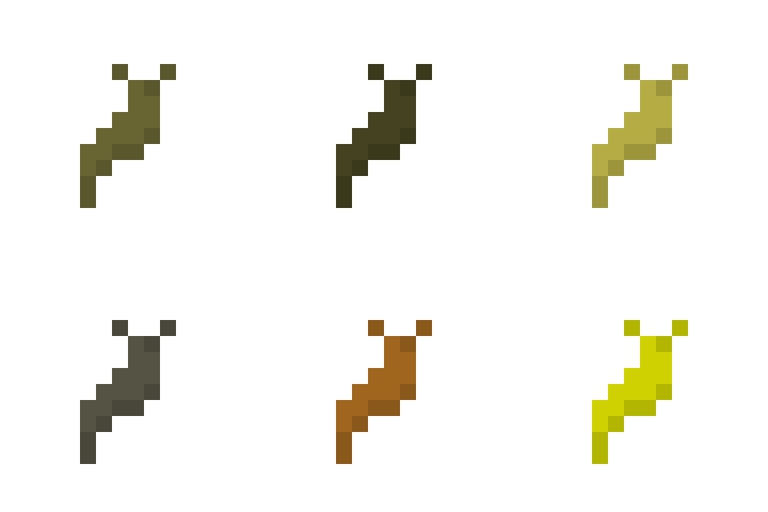

# large\_slugs

This is a mod for [Minetest][1] that adds large slugs of several species,
implemented as different nodes. They very slowly wander around, sticking to
surfaces, and asexually reproduce up to an approximate density. This behavior
can be tweaked or disabled if it becomes detrimental to performance.

## Species

Different species spawn on different surfaces, and their movement is restricted
to these different surfaces.

### Grass Slug

The light brown grass slug spawns on regular grass on the surface. It can only
move on grass and dirt.

Grass slugs can be eaten for one food point.

### Pine Slug

The dark brown pine slug spawns in pine forests. It can only move on dirt, pine
trees trunks, and the ground covering of the pine forests.

Pine slugs can be eaten for one food point.

### Rainforest Slug

The yellow rainforest slug spawns in rainforests. It can only move on dirt,
jungle tree trunks, and the ground covering of the rainforests.

Rainforest slugs can be eaten for two food points.

### Cave Slug

The gray cave slug spawn at level -32 and below on stone. It can only move on
stone, cobblestone, and coal-bearing stone.

Cave slugs can be eaten for two food points. Two cave slugs can be crafted into
a lump of coal.

### Iron Slug

The rust-colored iron slug spawns at level -128 and below on stone. It can only
move on stone, cobblestone, and iron ore.

Two iron slugs can be crafted into a lump of iron.

### Mese Slug

The bright yellow mese slug spawns at level -512 and below on stone. It can only
move on stone, cobblestone, and mese-bearing stone.

Three mese slugs can be crafted into a mese crystal fragment.

## Performance

Again, you can disable slug behavior entirely in the mod settings. However, I
have not observed a huge performance cost.

Implemented as nodes, slugs are less expensive to simulate than regular
entities. An ABM runs every 5 seconds\* to update active slugs. In a given
update, one out of every 5 slugs\* is actually updated\*\*. Only one out of
every 5 updated slugs\* tries to reproduce, while the rest just try to move.
Reproduction is more expensive than movement, since a birthing slug must check
up to 11 nodes\* around it in every direction to determine that it is the only
one of its species in the area.

\* These are default values. They can be changed in the settings.

\*\* The lower this value is, the more likely slugs are to double-move, due to
the way ABMs work.

## Mod dependencies

large\_slugs depends on the mod "default" because it refers to materials from
that mod. However, it would not be hard to adapt large\_slugs to a different
environment. You could keep the files api.lua, behavior.lua, and
settingtypes.txt but define your own slugs. To see how to do this, look in
slugs.lua. In order to make your slugs spawn in the world, I would recommend
registering them as decorations, as is done in mapgen.lua.

The optional dependency on the ethereal mod is just to fix a bug. I think that
large\_slugs must load after ethereal for slugs to spawn properly, but I'm not
sure why.

## Licenses

### Source code

The source code of this project is licensed under the LGPL v3 (or later,)
as stated in the source code files themselves.

### Images and other files not otherwise licensed

These files are licensed under a [CC BY-SA 3.0 license][2].

They are also under the same copyright as the source files:

Copyright © 2021 Jude Melton-Houghton

[1]: https://www.minetest.net/
[2]: https://creativecommons.org/licenses/by-sa/3.0/
